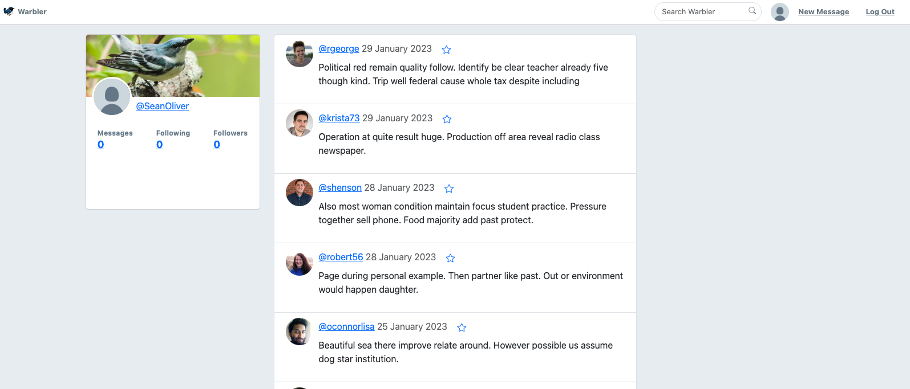
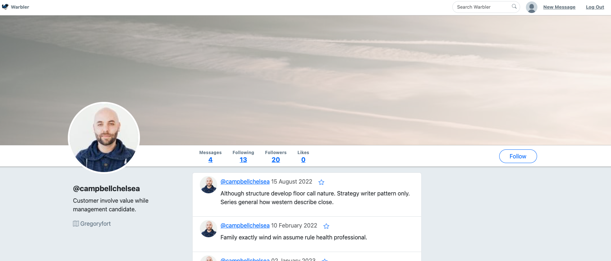
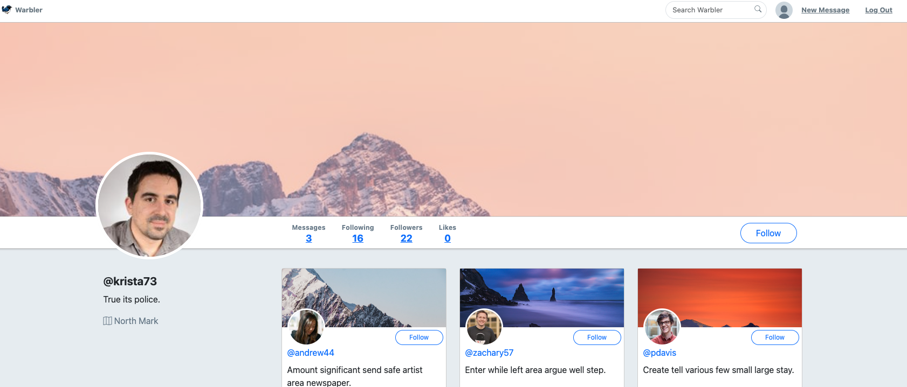

<a name="readme-top"></a>
<div align="center">
  <a href="https://github.com/seanoliver/warbler">
    
  </a>

  <h1 align="center">Warbler</h1>

  <p align="center">
    A less dystopian version of another popular social media app. <br />Tweet your thoughts, chirp your feelings, and warble your heart out.
    <br />
    <br />
    <a href="https://sean-warbler.onrender.com/" target="_blank">View Demo</a>
    ·
    <a href="https://github.com/seanoliver/warbler/issues">Report Bug</a>
    ·
    <a href="https://github.com/seanoliver/warbler/issues">Request Feature</a>
  </p>
</div>
<div align="center">


</div>

<!-- TABLE OF CONTENTS -->
<details>
  <summary>Table of Contents</summary>
  <ol>
    <li>
      <a href="#about-the-project">About The Project</a>
      <ul>
         <li><a href="#screenshots">Screenshots</a></li>
        <li><a href="#key-features">Key Features</a></li>
        <li><a href="#built-with">Built With</a></li>
      </ul>
    </li>
    <li>
      <a href="#getting-started">Getting Started</a>
    </li>
    <li><a href="#usage">Usage</a></li>
    <li><a href="#roadmap">Roadmap</a></li>
    <li><a href="#contributing">Contributing</a></li>
    <li><a href="#license">License</a></li>
    <li><a href="#contact">Contact</a></li>
    <li><a href="#acknowledgments">Acknowledgments</a></li>
  </ol>
</details>

<!-- ABOUT THE PROJECT -->

## About The Project

Warbler is a Twitter clone for people who like birds. It was originally built in 2023 as a project for the [Rithm School](https://www.rithmschool.com/) curriculum. It's a full-stack web application built with Flask, Python, Jinja, and PostgreSQL. The demo is hosted on [Render](https://render.com/) and the database is hosted on [ElephantSQL](https://www.elephantsql.com/).

This project is a great way to learn more about:

- Encryption and password hashing
- Database design and modeling
- User authentication and authorization
- User sessions and cookies
- RESTful routing

I'm excited to keep building on this project and add more features. Feel free to contribute!

<p align="right">(<a href="#readme-top">back to top</a>)</p>

### Screenshots

<p>
  
  <br>
  <em>Logged-In Timeline</em>
</p>

<p>
  
  <br>
  <em>User Profile Page</em>
</p>

<p>
  
  <br>
  <em>Followers Listing Page</em>
</p>

<p align="right">(<a href="#readme-top">back to top</a>)</p>

### Key Features

- Users can create an account and log in
- Users can edit their profile (including changing their profile picture)
- Users can write posts (called "warbles")
- Users can like warbles
- Users can follow other users
- Users can see the warbles of users they follow (called "following")
- Users can see who is following them
- Users can see their own warbles and their following warbles on their homepage
- Users can delete their own warbles
- Users can like and unlike warbles
- Users can see a list of all warblers
- Users can see a list of warbles that they have liked
- Users can see a list of warbles that they have posted

<p align="right">(<a href="#readme-top">back to top</a>)</p>

### Built With

This project was built in 2023 using the following technologies.

- ![Flask][Flask]
- ![Python][Python]
- ![Jinja][Jinja]
- ![SQLAlchemy][SQLAlchemy]
- ![PostgreSQL][PostgreSQL]
- ![WTForms][WTForms]
- ![Bcrypt][Bcrypt]
- ![Gunicorn][Gunicorn]
- ![Jquery][Jquery]
- ![Bootstrap][Bootstrap]

See [requirements.txt](https://github.com/seanoliver/warbler/blob/master/requirements.txt) for a full list of dependencies.

<p align="right">(<a href="#readme-top">back to top</a>)</p>

<!-- GETTING STARTED -->

## Getting Started

To get a local copy up and running follow these simple steps.

1. Clone this repository (only this branch)

   ```bash
   git clone
   ```

2. Create a virtual environment

   ```bash
   python3 -m venv venv
   source venv/bin/activate
   ```

3. Install dependencies

   ```bash
    pip install -r requirements.txt
   ```

4. Create database

   ```bash
    createdb warbler
   ```

5. Seed database

   ```bash
    python seed.py
   ```

6. Run the app

   ```bash
    flask run
   ```

7. Go to localhost:5000 to view the app

<p align="right">(<a href="#readme-top">back to top</a>)</p>

<!-- ROADMAP -->

## Roadmap

- [ ] Fix logout bug
- [ ] Update images in app
- [ ] Add toggle for all warbles vs. following warbles
- [ ] Migrate frontend to React

<p align="right">(<a href="#readme-top">back to top</a>)</p>

<!-- CONTRIBUTING -->

## Contributing

This is a great project for learning Flask, SQLAlchemy, and WTForms. Feel free to fork this repo and make it your own. If you have any questions or suggestions, please feel free to contact me!

1. Fork the Project
2. Create your Feature Branch (`git checkout -b feature/AmazingFeature`)
3. Commit your Changes (`git commit -m 'Add some AmazingFeature'`)
4. Push to the Branch (`git push origin feature/AmazingFeature`)
5. Open a Pull Request

<p align="right">(<a href="#readme-top">back to top</a>)</p>

<!-- LICENSE -->

## License

Distributed under the MIT License. See [LICENSE](https://github.com/seanoliver/warbler/LICENSE) for more information.

<p align="right">(<a href="#readme-top">back to top</a>)</p>

<!-- CONTACT -->

## Contact

Your Name - [@SeanOliver](https://twitter.com/SeanOliver) - helloseanoliver@gmail.com

Project Link: [https://github.com/seanoliver/warbler](https://github.com/seanoliver/warbler)

Live Demo: [https://sean-warbler.onrender.com/](https://sean-warbler.onrender.com/)

<p align="right">(<a href="#readme-top">back to top</a>)</p>

<!-- ACKNOWLEDGMENTS -->

## Acknowledgments

This was a project I completed as part of the [Rithm School](https://www.rithmschool.com/) curriculum. I would like to thank the entire Rithm team for their amazing curriculum and support.

- [Rithm School](https://www.rithmschool.com/)
- [Best-README-Template](https://github.com/othneildrew/Best-README-Template)
- [Img Shields](https://shields.io)
- [Twitter](https://twitter.com/)

<p align="right">(<a href="#readme-top">back to top</a>)</p>

<!-- TECHNOLOGY BADGES -->

[Flask]: https://img.shields.io/badge/Flask-007D69?logo=flask&logoColor=white
[Gunicorn]: https://img.shields.io/badge/Gunicorn-492548?logo=gunicorn&logoColor=white
[Python]: https://img.shields.io/badge/Python-3776AB?logo=python&logoColor=white
[Bcrypt]: https://img.shields.io/badge/Bcrypt-FF5700?logo=bcrypt&logoColor=white
[Jinja]: https://img.shields.io/badge/Jinja-B41717?logo=jinja&logoColor=white
[PostgreSQL]: https://img.shields.io/badge/PostgreSQL-316192?logo=postgresql&logoColor=white
[WTForms]: https://img.shields.io/badge/WTForms-2D9CDB?logo=wtforms&logoColor=white
[SQLAlchemy]: https://img.shields.io/badge/SQLAlchemy-1C2833?logo=sqlalchemy&logoColor=white
[Bootstrap]: https://img.shields.io/badge/Bootstrap-563D7C?logo=bootstrap&logoColor=white
[jQuery]: https://img.shields.io/badge/jQuery-0769AD?logo=jquery&logoColor=white
